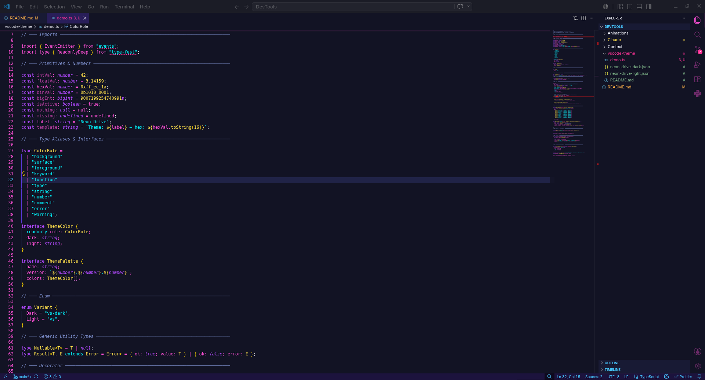
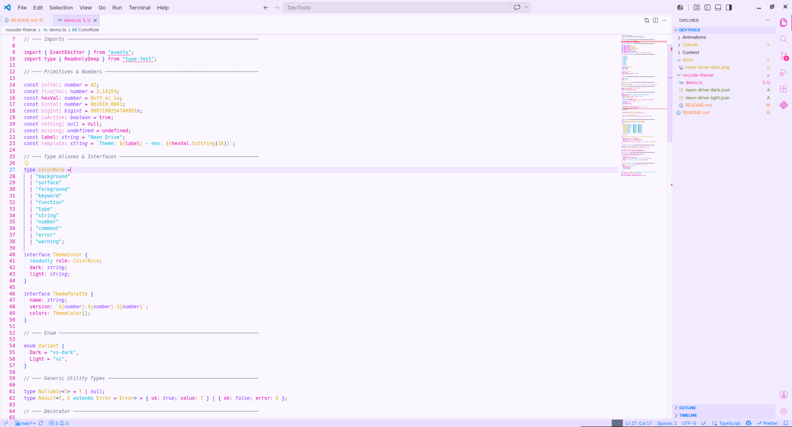

# DevTools

My personnal collection of scripts, claude skills and other stuff and tools I use accross projects.

## Tools

### Claude Code Skills

| Skill                                                     | Description                                                                                                                              |
| --------------------------------------------------------- | ---------------------------------------------------------------------------------------------------------------------------------------- |
| [nbip-claude-memory](/Claude/nbip-claude-memory/SKILL.md) | Persist and update session memory into the project's `CLAUDE.md` file so context survives across Claude Code CLI sessions.               |
| [nbip-pdf-to-note](/Claude/nbip-pdf-to-note/SKILL.md)     | Convert a PDF file into one or more clean, structured Obsidian markdown notes with frontmatter, wikilinks, callouts, and a course index. |

### Scripts

| Name                                           | Description                                                                             |
| ---------------------------------------------- | --------------------------------------------------------------------------------------- |
| [Project to Text](/Context/project_to_text.py) | A python script that generate a text file with the full context of the current project. |

### Animations

| Name                            | Animation                                                                                 |
| ------------------------------- | ----------------------------------------------------------------------------------------- |
| [Fairy](./Animations/fairy.svg) | <picture></picture> |

---

### VSCode Theme — Neon Drive

A cyberpunk synthwave VS Code theme in two variants: **Neon Drive Dark** and **Neon Drive Light**.

→ [Full documentation and installation](./vscode-theme/README.md)

| Dark                                                                                           | Light                                                                                          |
| ---------------------------------------------------------------------------------------------- | ---------------------------------------------------------------------------------------------- |
| <picture></picture> | <picture></picture> |
